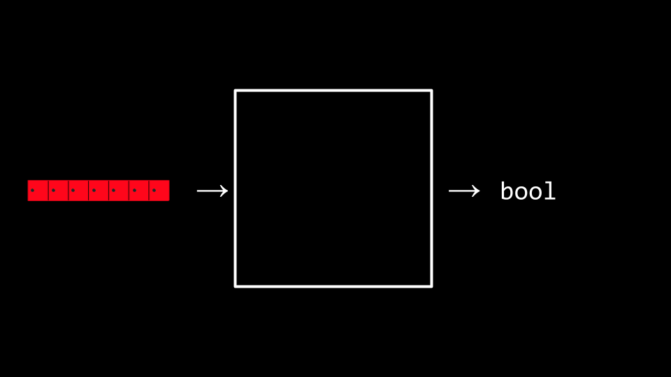
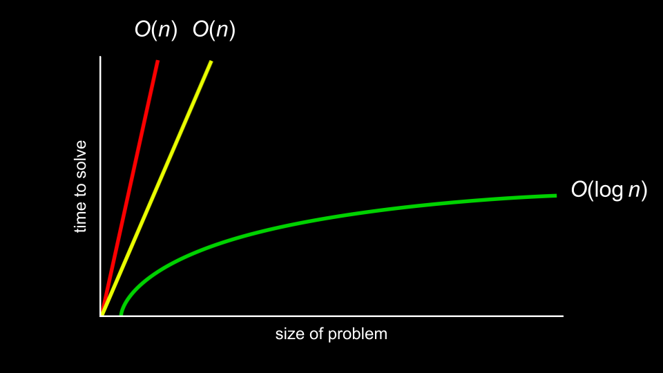

# CS50 Week3 Algorithms

- Data structures
  - encapsulate 封装
  - default value (not supported)

```C
typedef struct
{
  // ...
}
struct_name;
```

- 大 O 表示法 (Big O notation)
  - 时间复杂度
  - 空间复杂度
  - $O(1)$
  - $O(n)$
  - $O(n^2)$
  - $\Omega$(n) - best case
  - $\theta$(n) - best case and worst case are the same



- Search
  - linear search O(n)
  - binary search
    - sorted
    - $O(\log_{2}n)$ $\frac{n}{2^x} = 1$, x = O($\log_{2}n$)



- Sorting 排序

  - https://www.cs.usfca.edu/~galles/visualization/ComparisonSort.html
  - Selection sort 选择排序
    - $(n - 1) + (n - 2) + ... + 1 =n(n-1) - \frac{[1+(n-1)](n-1)}{2}=\frac{n(n-1)}{2}=\frac{1}{2}n^2-\frac{1}{2}n$
    - $O(n^2)$
  - Bubble sort 冒泡排序
    - $O(n^2)$
    - $\Omega(n)$
  - 递归 Recursion
    - a function calls itself.
  - Merge sort 归并排序
    - more space
    - $O(nlog_{2}n)$

  $$
    T(n)=2T(\frac{n}{2})+n \to T(n)=2^kT(\frac{n}{2^k})+ kn
  $$

  $$
  \frac{n}{2^k}=1,n=2^k,T(1)=0 \to T(2^k)=2^kT(1)+kn=kn \to k=\log_{2}n, T(n)=n\log_{2}n
  $$
